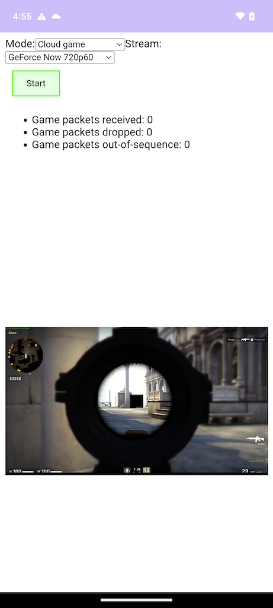

# GameBench WebRTC Stats Demo App

This is an Android app containing a WebView that connects a WebRTC stream. The GameBench SDK automatically detects usage of WebRTC and records performance stats into a GameBench session file which will be uploaded to the GameBench server for later analysis once the app is sent to the background. 

Before you can build and run it you will need to:

1. Obtain GameBench's SDK and extract the file `GameBench.aar`. Copy this into the `app/lib` folder of this demo project.
2. Open the source file `MainActivity.kt` and replace the three placeholder config values with your own GameBench values.

